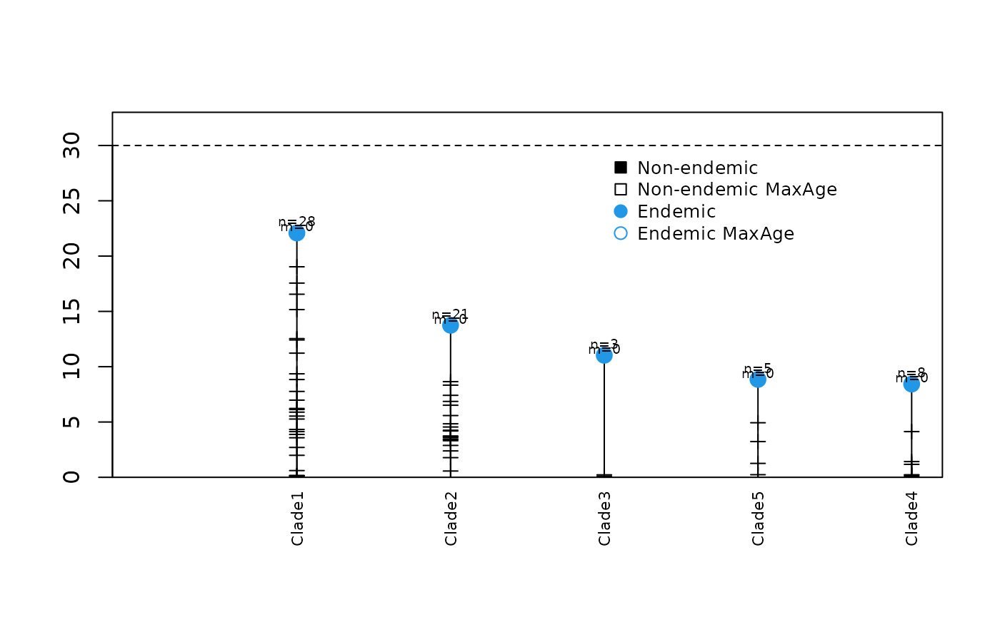
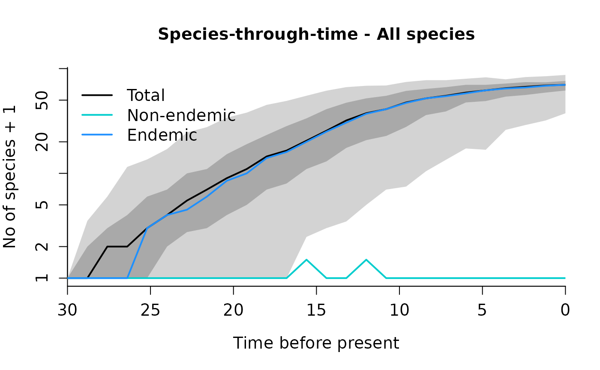

# Demo: Fitting clade-specific and island-wide diversity-dependence models in DAISIE

Load required package [DAISIE](https://github.com/rsetienne/DAISIE)

``` r
library(DAISIE)
```

### 1. Load, prepare and visualize data

- If you want to start directly with model fitting you can skip this
  step and go to step 2.

Load the phylogenetic data for *Eleutherodacylus* frogs from the island
of Hispaniola (used in Etienne et al. 2020). This dataset contains times
of colonization and branching times for all species of
*Eleutherodactylus* frogs found on the island. The data was extracted
from the dated molecular phylogeny of Dugo-Cota et al 2019 (*Ecology
Letters* 22:884–893). The dataset includes 65 extant species, which are
the result of five independent colonisation events of the island of
Hispaniola.

``` r
data(frogs_datatable, package = "DAISIE")
```

You can load your own data in a table/tibble format, making sure the
table headers match the ones in the example.

| Clade_name | Status  | Missing_species | Branching_times                                                                                                                                                                                                                                                                                                                                       |
|:-----------|:--------|----------------:|:------------------------------------------------------------------------------------------------------------------------------------------------------------------------------------------------------------------------------------------------------------------------------------------------------------------------------------------------------|
| Clade1     | Endemic |               0 | 22.090381975,19.03474267,17.558899475,16.551943175,15.163574647,12.539890494,12.418166302,11.224140324,9.356313022,8.838345923,7.763917546,6.976872428,6.225535797,6.128306647,5.891490086,5.534313767,5.268246402,4.325862315,4.130254551,3.876175449,3.576820015,2.700899509,1.988973569,0.609739668,0.16651871,0.149491685,0.138726728,0.038275342 |
| Clade2     | Endemic |               0 | 13.746625455,8.647464943,8.334079223,7.411910463,6.861782812,6.516839176,5.584497643,4.839004311,4.549481508,4.254369184,4.188654945,3.73901781,3.667503378,3.593658733,3.460220365,3.419754656,3.30938242,2.883634139,2.387378752,1.77824651,0.568917703                                                                                             |
| Clade3     | Endemic |               0 | 11.032464497,0.224004413,0.102526748                                                                                                                                                                                                                                                                                                                  |
| Clade4     | Endemic |               0 | 8.430721468,4.130831021,1.420117489,1.171228154,0.231664348,0.197599408,0.075831995,0.040222432                                                                                                                                                                                                                                                       |
| Clade5     | Endemic |               0 | 8.852578907,4.93343221,3.230048172,1.259294338,0.235900375                                                                                                                                                                                                                                                                                            |

Eleutherodactylus data table

##### The table contains the following 4 columns (column headers need to be written exactly like this):

- `Clade_name` - Name of the clade/lineage on the island (e.g. clade
  code, genus name)  
- `Status` - Endemicity status of the clade. Can be the following
  `Endemic`; `Non_endemic`; `Endemic_MaxAge`, `Non_Endemic_MaxAge` The
  latter two options are for cases when the time of colonisation is
  believed to be an overestimate. In these cases, DAISIE will assume
  colonisation happened any time between the colonisation time given in
  `Branching_times` and the present, or between the colonisation time
  given in `Branching_times` and the age of the first cladogenesis event
  in the lineage (if any). The MaxAge options can also be used when the
  colonization time is unknown, specifying “NA” in the column
  `Branching_times`, in which case DAISIE will assume that colonisation
  happened any time between the age of the island and the present.
- `Missing_species` - Number of extant species that belong to the clade
  but are not included in the phylogeny.
- `Branching_times` - First element is the colonisation time, subsequent
  elements are branching times within the island if there are any.
  e.g. c(colonisation_time, branching_time1; branching_time2). If
  colonisation time is unknown, ‘NA’ can be specified. If branching
  times are unknown, do not replace them with ‘NA’ - just add the
  corresponding number of missing species to the column
  `Missing_species`.

  

  

### 1.1. Create DAISIE datalist from the input table

In this case we are assuming an island age of 30 million years for
Hispaniola and a mainland pool size of 300 species (this is the number
of species that may colonize the island).

``` r
frogs_datalist <- DAISIE_dataprep(
        datatable = frogs_datatable,
        island_age = 30,
        M = 300)
```

  

### 1.2. View DAISIE datalist

Just type:

``` r
frogs_datalist
```

The DAISIE datalist includes the data from the table `frogs` in the
format of a DAISIE object that can be read in the subsequent maximum
likelihood functions (e.g `DAISIE_ML`, `DAISIE_ML_IW` ). It includes the
age of the island, the number of mainland species that are not currently
present on the island and a list with all extant independent
colonisation events, including their colonization and branching times.

### 1.3. Visualise the data

``` r
DAISIE_plot_island(frogs_datalist)
```



This plot shows the different colonization events, their times of
colonization and branching times (horizontal ticks). Dashed line shows
the age of the island. n=number of species; m= number of species
missing.

     
  
     
       
  
     
 

#### Plot age versus diversity

``` r
# DAISIE_plot_age_diversity(frogs_datalist)
```

### 2. Fit DAISIE models

If you skipped step 1, first load the Hispaniola *Eleutherodactylus*
datalist.

``` r
data(frogs_datalist)
```

\_

We will fit five different DAISIE models to the phylogenetic data
contained in `frogs_datalist`:

- **DI** - diversity-independent model. Model where K’
  (carrying-capacity) is set to `Inf`.
- **CS** - clade-specific diversity-dependence model.
- **CS_no_ana** - clade-specific diversity-dependence model with no
  anagenesis. *Equivalent to the CS model in Etienne et al. 2020*.
- **IW** - island-wide diversity-dependence model.
- **IW_no_ana** - island-wide diversity-dependence model with no
  anagenesis. *Equivalent to the IW model in Etienne et al. 2020*.

We use the `DAISIE_ML` and `DAISIE_ML_IW` functions to optimise the
likelihood. These are the most important settings to specify in these
functions:

- `datalist` - The name of the DAISIE datalist (in this case
  `frogs_datalist`)
- `initparsopt` - these are the initial values from the parameters for
  which the likelihood will be optimised. In the examples below we will
  use parameters similar to the maximum likelihood parameters from the
  corresponding models in Etienne et al 2020. However, we recommend you
  try a variety of initial starting parameters to ensure the optimum is
  found. Note that certain combinations of initial starting values may
  fail, as parameters must be feasible (e.g. a K’ value lower than the
  number of species found in the data will not run). In DAISIE the
  parameters have the following position:
  1.  Rate of cladogenesis (per species on the island per time unit)
  2.  Rate of extinction (per species on the island per time unit)
  3.  Carrying-capacity (K’) - maximum number of species any clade can
      reach on the island for CS models; maximum number of species on
      the island across all clades for IW models.
  4.  Rate of colonisation (per species on the mainland per time unit)
  5.  Rate of anagenesis (per species on the island per time unit)
- `idparsopt` - The position of the parameters to optimise (e.g. to
  optimize cladogenesis and anagenesis only c(1,5).
- `parsfix` - If parameters are being fixed, specify here the value
  (e.g. if fixing K’ to Inf and fixing anagenesis to 0 - c(Inf,0).
- `idparsfix` - The position of the paratemers fixed (e.g. to fix K’ and
  anagenesis c(3,5)).
- `ddmodel` - Set 0 for diversity-independent models; 11 for
  diversity-dependent models (IW and CS) where cladogenesis and
  colonisation decline linearly with diversity. There are other options.
- There are many other options, check
  [`? DAISIE_ML`](https://rsetienne.github.io/DAISIE/reference/DAISIE_ML.md)

 

> **The IW models (IW and IW_no_ana) use the island-wide version of
> DAISIE, which is computationally demanding. They require high memory
> and long run times. We recommend these are run on a cluster. The CS
> models can be run on a regular computer or laptop.**

 

### 2.1 Fit DI model

This model contains 4 parameters:  
1 - cladogenesis  
2 - extinction  
4 - colonisation  
5 - anagenesis  
K’ is fixed to `Inf`  
Set `ddmodel=0`

``` r
DAISIE_ML(
  datalist = frogs_datalist,
  initparsopt = c(0.18,0.03,0.0006,2),
  idparsopt = c(1,2,4,5),
  ddmodel = 0,
  parsfix = Inf,
  idparsfix = 3
)
```

    #>    lambda_c         mu   K        gamma lambda_a    loglik df conv
    #> 1 0.1789218 0.02509053 Inf 0.0006259365  1568.88 -209.8634  4    0

 

### 2.2 Fit CS model

This model contains 5 parameters:  
1 - cladogenesis  
2 - extinction  
3 - K’  
4 - colonisation  
5 - anagenesis  
Set `ddmodel=11`

``` r
DAISIE_ML(
  datalist = frogs_datalist,
  initparsopt = c(0.44,0.11,36.44,0.0007,2),
  idparsopt = c(1,2,3,4,5),
  ddmodel = 11,
  parsfix = NULL,
  idparsfix = NULL
)
```

Output not shown here.  

### 2.3 Fit CS_no_ana model

This model contains 4 parameters:  
1 - cladogenesis  
2 - extinction  
3 - K’  
4 - colonisation  
Set `ddmodel=11`

``` r
DAISIE_ML(
  datalist = frogs_datalist,
  initparsopt = c(0.44,0.11,36.44,0.0007),
  idparsopt = c(1,2,3,4),
  ddmodel = 11,
  parsfix = 0,
  idparsfix = 5
)
```

Output not shown here.

 

### 2.4 Fit IW model

This model contains 5 parameters:  
1 - cladogenesis  
2 - extinction  
3 - K’  
4 - colonisation  
5 - anagenesis  
Set `ddmodel=11`

``` r
DAISIE_ML_IW(
  datalist = frogs_datalist,
  initparsopt = c(0.41, 0.17, 131.7, 0.0012, 2),
  idparsopt = c(1,2,3,4,5),
  ddmodel = 11,
  parsfix = NULL,
  idparsfix = NULL
)
```

Output not shown here (recommended to be run on a cluster).

 

### 2.5 Fit IW_no_ana model

This model contains 4 parameters:  
1 - cladogenesis  
2 - extinction  
3 - K’  
4 - colonisation  
Set `ddmodel=11`

``` r
DAISIE_ML_IW(
  datalist = frogs_datalist,
  initparsopt = c(0.40, 0.17, 131.83, 0.0012),
  idparsopt = c(1,2,3,4),
  ddmodel = 11,
  parsfix = 0,
  idparsfix = 5
)
```

Output not shown here (recommended to be run on a cluster).  

### 3. Simulate islands under given DAISIE models

##### 3.1 Simulate islands with the parameters estimated from the best model for the Hispaniolan *Eleutherodacytlus* data

We use the `DAISIE_sim` function, which simulates diversity dynamics on
an island from island birth until a specificied island age, based on a
given set of parameters (cladogenesis, extinction, carrying-capacity
(K’), colonisation, anagenesis). These are the most important settings
to specify in `DAISIE_sim` function:

- `pars` - The values of the 5 parameters in the following order
  1.  Rate of cladogenesis
  2.  Rate of extinction
  3.  Carrying-capacity (K’)
  4.  Rate of colonisation
  5.  Rate of anagenesis
- `replicates` - Number of replicates to simulate
- `time` - Time to run the simulation, for example 20 million years
- `M` - Number species in the mainland pool
- `divdepmodel` - set `CS` for clade-specific diversity-dependence; or
  `IW` for island-wide diversity-dependence

Simulate a CS model for 30 million years, 100 replicates:

``` r
set.seed(1)
frog_sims_CS <- DAISIE_sim_cr(
  time=30,
  M=300,
  pars=c(0.44,0.11,36.44,0.0007,0),
  divdepmodel = "CS",
  replicates= 100,
  plot_sims = FALSE)
#> Island replicate 1
#> Island replicate 2
#> Island replicate 3
#> Island replicate 4
#> Island replicate 5
#> Island replicate 6
#> Island replicate 7
#> Island replicate 8
#> Island replicate 9
#> Island replicate 10
#> Island replicate 11
#> Island replicate 12
#> Island replicate 13
#> Island replicate 14
#> Island replicate 15
#> Island replicate 16
#> Island replicate 17
#> Island replicate 18
#> Island replicate 19
#> Island replicate 20
#> Island replicate 21
#> Island replicate 22
#> Island replicate 23
#> Island replicate 24
#> Island replicate 25
#> Island replicate 26
#> Island replicate 27
#> Island replicate 28
#> Island replicate 29
#> Island replicate 30
#> Island replicate 31
#> Island replicate 32
#> Island replicate 33
#> Island replicate 34
#> Island replicate 35
#> Island replicate 36
#> Island replicate 37
#> Island replicate 38
#> Island replicate 39
#> Island replicate 40
#> Island replicate 41
#> Island replicate 42
#> Island replicate 43
#> Island replicate 44
#> Island replicate 45
#> Island replicate 46
#> Island replicate 47
#> Island replicate 48
#> Island replicate 49
#> Island replicate 50
#> Island replicate 51
#> Island replicate 52
#> Island replicate 53
#> Island replicate 54
#> Island replicate 55
#> Island replicate 56
#> Island replicate 57
#> Island replicate 58
#> Island replicate 59
#> Island replicate 60
#> Island replicate 61
#> Island replicate 62
#> Island replicate 63
#> Island replicate 64
#> Island replicate 65
#> Island replicate 66
#> Island replicate 67
#> Island replicate 68
#> Island replicate 69
#> Island replicate 70
#> Island replicate 71
#> Island replicate 72
#> Island replicate 73
#> Island replicate 74
#> Island replicate 75
#> Island replicate 76
#> Island replicate 77
#> Island replicate 78
#> Island replicate 79
#> Island replicate 80
#> Island replicate 81
#> Island replicate 82
#> Island replicate 83
#> Island replicate 84
#> Island replicate 85
#> Island replicate 86
#> Island replicate 87
#> Island replicate 88
#> Island replicate 89
#> Island replicate 90
#> Island replicate 91
#> Island replicate 92
#> Island replicate 93
#> Island replicate 94
#> Island replicate 95
#> Island replicate 96
#> Island replicate 97
#> Island replicate 98
#> Island replicate 99
#> Island replicate 100
#> Island being formatted: 1/100
#> Island being formatted: 2/100
#> Island being formatted: 3/100
#> Island being formatted: 4/100
#> Island being formatted: 5/100
#> Island being formatted: 6/100
#> Island being formatted: 7/100
#> Island being formatted: 8/100
#> Island being formatted: 9/100
#> Island being formatted: 10/100
#> Island being formatted: 11/100
#> Island being formatted: 12/100
#> Island being formatted: 13/100
#> Island being formatted: 14/100
#> Island being formatted: 15/100
#> Island being formatted: 16/100
#> Island being formatted: 17/100
#> Island being formatted: 18/100
#> Island being formatted: 19/100
#> Island being formatted: 20/100
#> Island being formatted: 21/100
#> Island being formatted: 22/100
#> Island being formatted: 23/100
#> Island being formatted: 24/100
#> Island being formatted: 25/100
#> Island being formatted: 26/100
#> Island being formatted: 27/100
#> Island being formatted: 28/100
#> Island being formatted: 29/100
#> Island being formatted: 30/100
#> Island being formatted: 31/100
#> Island being formatted: 32/100
#> Island being formatted: 33/100
#> Island being formatted: 34/100
#> Island being formatted: 35/100
#> Island being formatted: 36/100
#> Island being formatted: 37/100
#> Island being formatted: 38/100
#> Island being formatted: 39/100
#> Island being formatted: 40/100
#> Island being formatted: 41/100
#> Island being formatted: 42/100
#> Island being formatted: 43/100
#> Island being formatted: 44/100
#> Island being formatted: 45/100
#> Island being formatted: 46/100
#> Island being formatted: 47/100
#> Island being formatted: 48/100
#> Island being formatted: 49/100
#> Island being formatted: 50/100
#> Island being formatted: 51/100
#> Island being formatted: 52/100
#> Island being formatted: 53/100
#> Island being formatted: 54/100
#> Island being formatted: 55/100
#> Island being formatted: 56/100
#> Island being formatted: 57/100
#> Island being formatted: 58/100
#> Island being formatted: 59/100
#> Island being formatted: 60/100
#> Island being formatted: 61/100
#> Island being formatted: 62/100
#> Island being formatted: 63/100
#> Island being formatted: 64/100
#> Island being formatted: 65/100
#> Island being formatted: 66/100
#> Island being formatted: 67/100
#> Island being formatted: 68/100
#> Island being formatted: 69/100
#> Island being formatted: 70/100
#> Island being formatted: 71/100
#> Island being formatted: 72/100
#> Island being formatted: 73/100
#> Island being formatted: 74/100
#> Island being formatted: 75/100
#> Island being formatted: 76/100
#> Island being formatted: 77/100
#> Island being formatted: 78/100
#> Island being formatted: 79/100
#> Island being formatted: 80/100
#> Island being formatted: 81/100
#> Island being formatted: 82/100
#> Island being formatted: 83/100
#> Island being formatted: 84/100
#> Island being formatted: 85/100
#> Island being formatted: 86/100
#> Island being formatted: 87/100
#> Island being formatted: 88/100
#> Island being formatted: 89/100
#> Island being formatted: 90/100
#> Island being formatted: 91/100
#> Island being formatted: 92/100
#> Island being formatted: 93/100
#> Island being formatted: 94/100
#> Island being formatted: 95/100
#> Island being formatted: 96/100
#> Island being formatted: 97/100
#> Island being formatted: 98/100
#> Island being formatted: 99/100
#> Island being formatted: 100/100
```

Simulate an IW model for 30 million years, 100 replicates:

``` r
set.seed(1)
frog_sims_CS <- DAISIE_sim_cr(
  time=30,
  M=300,
  pars=c(0.40,0.17,131.83,0.0012,0),
  divdepmodel = "IW",
  replicates= 100,
  plot_sims = FALSE)
#> Island replicate 1
#> Island replicate 2
#> Island replicate 3
#> Island replicate 4
#> Island replicate 5
#> Island replicate 6
#> Island replicate 7
#> Island replicate 8
#> Island replicate 9
#> Island replicate 10
#> Island replicate 11
#> Island replicate 12
#> Island replicate 13
#> Island replicate 14
#> Island replicate 15
#> Island replicate 16
#> Island replicate 17
#> Island replicate 18
#> Island replicate 19
#> Island replicate 20
#> Island replicate 21
#> Island replicate 22
#> Island replicate 23
#> Island replicate 24
#> Island replicate 25
#> Island replicate 26
#> Island replicate 27
#> Island replicate 28
#> Island replicate 29
#> Island replicate 30
#> Island replicate 31
#> Island replicate 32
#> Island replicate 33
#> Island replicate 34
#> Island replicate 35
#> Island replicate 36
#> Island replicate 37
#> Island replicate 38
#> Island replicate 39
#> Island replicate 40
#> Island replicate 41
#> Island replicate 42
#> Island replicate 43
#> Island replicate 44
#> Island replicate 45
#> Island replicate 46
#> Island replicate 47
#> Island replicate 48
#> Island replicate 49
#> Island replicate 50
#> Island replicate 51
#> Island replicate 52
#> Island replicate 53
#> Island replicate 54
#> Island replicate 55
#> Island replicate 56
#> Island replicate 57
#> Island replicate 58
#> Island replicate 59
#> Island replicate 60
#> Island replicate 61
#> Island replicate 62
#> Island replicate 63
#> Island replicate 64
#> Island replicate 65
#> Island replicate 66
#> Island replicate 67
#> Island replicate 68
#> Island replicate 69
#> Island replicate 70
#> Island replicate 71
#> Island replicate 72
#> Island replicate 73
#> Island replicate 74
#> Island replicate 75
#> Island replicate 76
#> Island replicate 77
#> Island replicate 78
#> Island replicate 79
#> Island replicate 80
#> Island replicate 81
#> Island replicate 82
#> Island replicate 83
#> Island replicate 84
#> Island replicate 85
#> Island replicate 86
#> Island replicate 87
#> Island replicate 88
#> Island replicate 89
#> Island replicate 90
#> Island replicate 91
#> Island replicate 92
#> Island replicate 93
#> Island replicate 94
#> Island replicate 95
#> Island replicate 96
#> Island replicate 97
#> Island replicate 98
#> Island replicate 99
#> Island replicate 100
#> Island being formatted: 1/100
#> Island being formatted: 2/100
#> Island being formatted: 3/100
#> Island being formatted: 4/100
#> Island being formatted: 5/100
#> Island being formatted: 6/100
#> Island being formatted: 7/100
#> Island being formatted: 8/100
#> Island being formatted: 9/100
#> Island being formatted: 10/100
#> Island being formatted: 11/100
#> Island being formatted: 12/100
#> Island being formatted: 13/100
#> Island being formatted: 14/100
#> Island being formatted: 15/100
#> Island being formatted: 16/100
#> Island being formatted: 17/100
#> Island being formatted: 18/100
#> Island being formatted: 19/100
#> Island being formatted: 20/100
#> Island being formatted: 21/100
#> Island being formatted: 22/100
#> Island being formatted: 23/100
#> Island being formatted: 24/100
#> Island being formatted: 25/100
#> Island being formatted: 26/100
#> Island being formatted: 27/100
#> Island being formatted: 28/100
#> Island being formatted: 29/100
#> Island being formatted: 30/100
#> Island being formatted: 31/100
#> Island being formatted: 32/100
#> Island being formatted: 33/100
#> Island being formatted: 34/100
#> Island being formatted: 35/100
#> Island being formatted: 36/100
#> Island being formatted: 37/100
#> Island being formatted: 38/100
#> Island being formatted: 39/100
#> Island being formatted: 40/100
#> Island being formatted: 41/100
#> Island being formatted: 42/100
#> Island being formatted: 43/100
#> Island being formatted: 44/100
#> Island being formatted: 45/100
#> Island being formatted: 46/100
#> Island being formatted: 47/100
#> Island being formatted: 48/100
#> Island being formatted: 49/100
#> Island being formatted: 50/100
#> Island being formatted: 51/100
#> Island being formatted: 52/100
#> Island being formatted: 53/100
#> Island being formatted: 54/100
#> Island being formatted: 55/100
#> Island being formatted: 56/100
#> Island being formatted: 57/100
#> Island being formatted: 58/100
#> Island being formatted: 59/100
#> Island being formatted: 60/100
#> Island being formatted: 61/100
#> Island being formatted: 62/100
#> Island being formatted: 63/100
#> Island being formatted: 64/100
#> Island being formatted: 65/100
#> Island being formatted: 66/100
#> Island being formatted: 67/100
#> Island being formatted: 68/100
#> Island being formatted: 69/100
#> Island being formatted: 70/100
#> Island being formatted: 71/100
#> Island being formatted: 72/100
#> Island being formatted: 73/100
#> Island being formatted: 74/100
#> Island being formatted: 75/100
#> Island being formatted: 76/100
#> Island being formatted: 77/100
#> Island being formatted: 78/100
#> Island being formatted: 79/100
#> Island being formatted: 80/100
#> Island being formatted: 81/100
#> Island being formatted: 82/100
#> Island being formatted: 83/100
#> Island being formatted: 84/100
#> Island being formatted: 85/100
#> Island being formatted: 86/100
#> Island being formatted: 87/100
#> Island being formatted: 88/100
#> Island being formatted: 89/100
#> Island being formatted: 90/100
#> Island being formatted: 91/100
#> Island being formatted: 92/100
#> Island being formatted: 93/100
#> Island being formatted: 94/100
#> Island being formatted: 95/100
#> Island being formatted: 96/100
#> Island being formatted: 97/100
#> Island being formatted: 98/100
#> Island being formatted: 99/100
#> Island being formatted: 100/100
```

 

#### 3.2 Plot the species-through-time plots resulting from the simulations.

``` r
DAISIE_plot_sims(frog_sims_CS)
```


